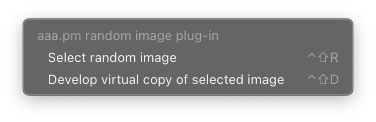

# aaa.pm random image plug-in

A simple plug-in for Adobe Lightroom created to facilitate a regular editing habit.

The plug-in has two functions:

1. **Select random image** Selects a random image out of all the images in the current catalog, and switches the view to loupe, so the image gets bigger.
2. **Develop virtual copy of selected image** Creates a new, named virtual copy (`aaadotpm-routine`) of the currently selected image, and takes you to Lightroom’s Develop mode.

At an interval of my liking, I can open Lightroom and press my mapped keyboard shortcut `⌃⇧R` to bring up a randomly selected photo from my catalog.

If I like the photo, I will hit `⌃⇧D` to do a quick edit and export it to a specific folder. This way, I won’t be tied to chronology, and won't be lured into doing edits for all the adjacent photos in the catalog.

The plug-in has only been tested on a Mac using version 10 of Adobe Lightroom. Feel free to download and modify to suit your needs. See [the license](LICENSE) for more information.

This software comes with no guarantees. Always use a test catalog when developing plug-ins.

## Mapping keyboard shortcuts to plug-in functions on MacOS

On a Mac it is easy to map keyboard shortcuts to any menu item of any application.

1. Open system preferences and go to Keyboard > Shortcuts
2. Add a new shortcut for `Adobe Lightroom Classic`
3. Type the name of the plug-in function preceded by 3 spaces `   Select random image` or `   Develop virtual copy of selected image`

In lightroom, you should now something like:

